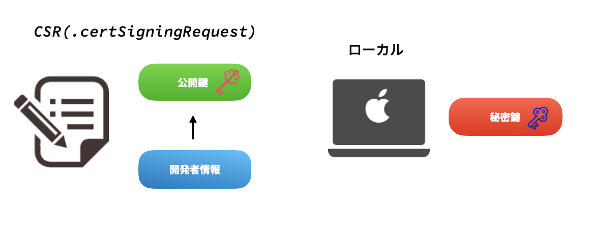

# 証明書について知る

iOSアプリにおける証明(署名)とは、iOSが信頼できるアプリしかインストールできないようにするための仕組みであり、以下の2点が保証されます。

* 開発者の特定できる
* 開発者が署名してからアプリが改変されていない

## 全体像

## 詳細

### 1.秘密鍵・公開鍵の作成

秘密鍵・公開鍵とは。。。？

公開鍵暗号方式によって、証明書を開発者本人が使用しているかを特定することができます。

iOSアプリにおいては以下のように検証されます。

* アプリの開発者は、公開鍵/秘密鍵のペアを用意します
  * 公開鍵はデジタル証明書の形でインストール先のiOSに渡されます
  * 秘密鍵は鍵ペアを生成したマシンに保持され、署名に使われます

* アプリをアーカイブする際、あらかじめ決められた手順でアプリからハッシュ値を計算し、これを秘密鍵で暗号化してアプリに同梱します。このプロセスが署名と呼ばれます。

* アプリをインストールしたiOSは、同じ手順でアプリからハッシュ値を計算します。一方で、アーカイブ時に計算されて暗号化されたハッシュ値は証明書に含まれる開発者の公開鍵で復号します。これら2つの方法で得られたハッシュ値が一致することを確認します。

**暗号化されたハッシュ値が復号できた** → 開発者の特定ができる(暗号化したのは開発者の秘密鍵であり、秘密鍵を持っているのは開発者本人のため)

**ハッシュ値が一致した** → 開発者が署名してからアプリが改変されていない(アプリの内容が変更された場合はハッシュ値が変わって一致しなくなるため)

### 2.CSR(証明書署名要求)の送付

CSRは証明書署名リクエストであり、公開鍵に開発者情報などを付与したものになります。

これを認証局(Apple)に送付することで、Appleから証明書を貰うことができます。

※ CSRは作成時に公開鍵と秘密鍵のペアが生成され、公開鍵はSCRに含まれ、秘密鍵はローカルマシンに保存されます。

#### CSR作成方法

1. キーチェンアクセス → 証明書アシスタント → 認証局に証明書を要求

2. 証明書情報を入力、ローカルに保存

3. 鍵ペア情報入力(2048ビット、RSA選択)

### 3.証明書(Certificate)作成

開発者の公開鍵に、Appleが自身の秘密鍵で署名したものが証明書(Certificate)になります。

iOSはまずAppleの署名を検証することで、公開鍵が証明書に書いてある開発者自身のものであり、かつ改変されていないことを確認することができます。

→ **信頼できる公開鍵をiOSに提供することができる**

#### Certificate作成方法

pending...

### 4.証明書登録

証明書を作成してローカルマシンに取り込むと、キーチェーンアクセス上で証明書(に含まれている公開鍵)と秘密鍵が紐づきます。(証明書しか表示されない場合はCSRを作成したローカルマシンと証明書を取り込んだローカルマシンが一致していない可能性があります)

### 寄り道 (Signing Identity)

署名を実際に行うためには、`4.証明書登録`での秘密鍵を証明書に紐づけたSinging Identityの形式(.p12)にしておく必要があります。

このp12ファイルはキーチェーン上でエクスポートすることもできます。

例えば、新しいマシンに買い替えた時は、新しいマシン側に秘密鍵がないため署名することができず、実機ビルドやアプリリリースをすることができません。こうした場合に、古いマシンからp12ファイルを新しいマシンに渡すことで新しいマシンで署名を行うことが可能になります。

### 5.AppID登録

### 6.Device登録

### 7.プロビジョニングプロファイル登録(Apple Developer)

プロビジョニングプロファイル(.mobileprovision)はXcodeから実機端末へのビルドや、リリース前にアプリをテスト的に社内配布をしたい時など、App Store以外の手段でアプリをiOSにインストールさせたい時に必要になります。

アプリをiOS端末で実行するためには、公開鍵を使ったコード署名の検証だけでなく、合計で以下の3つの検証をパスする必要があります。そこで、検証に必要な情報を全て含めたものがプロビジョニングプロファイルになります。

1. プロビジョニングプロファイルに含まれる証明書の公開鍵を使ってコード署名が正しいかどうか
2. プロビジョニングプロファイルに含まれるAppIDがアプリのBundleIDと一致しているかどうか
3. プロビジョニングプロファイルに含まれるDeviceIDのリストにアプリを実行しようとしている端末デバイスIDが含まれているかどうか

### 8.プロビジョニングプロファイル登録(ローカル)

### 9.ビルド設定

### 10.ビルド・アーカイブ

## 参考文献

https://kumaskun.hatenablog.com/entry/2022/09/20/210919

https://qiita.com/maiyama18/items/88567365dde2a3b3cc92#%E3%82%B3%E3%83%BC%E3%83%89%E7%BD%B2%E5%90%8D%E3%81%AE%E7%99%BB%E5%A0%B4%E4%BA%BA%E7%89%A9

https://scrapbox.io/tasuwo-ios/Xcode_%E3%81%A8%E7%BD%B2%E5%90%8D